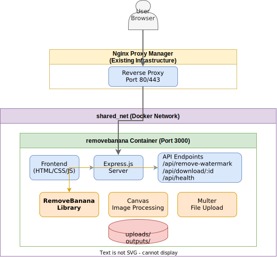
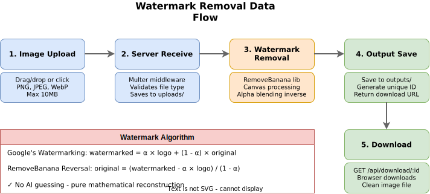

# RM Banana Web UI

[](https://www.docker.com/)
[](https://nodejs.org/)
[](https://expressjs.com/)
[](LICENSE)

> A Dockerized web interface for removing invisible AI watermarks from Google Gemini-generated images.

RM Banana provides a clean, modern web UI for the [removebanana](https://github.com/denuwanpro/removebanana) library. All processing happens locally in your Docker environment with complete privacy.

**Upstream Project:** https://github.com/denuwanpro/removebanana

## Features

- **Drag & Drop Interface** - Easy image upload with visual feedback
- **Privacy First** - All processing happens locally in your Docker environment
- **Mathematical Precision** - Uses inverse alpha blending (no AI guessing)
- **Responsive Design** - Works on desktop and mobile devices
- **NPM Integration** - Designed to work with existing Nginx Proxy Manager setups
- **Health Checks** - Built-in container health monitoring

## Architecture



> See [docs/diagrams/](./docs/diagrams/) for editable `.drawio` source files.

## Prerequisites

- Docker & Docker Compose installed
- Existing Nginx Proxy Manager on the `shared_net` Docker network

## Quick Start

### 1. Clone & Start

```bash
git clone https://github.com/yourusername/rmbanana.git
cd rmbanana

# Create shared network if not exists
docker network create shared_net

# Start the container
docker-compose up -d
```

### 2. Configure in Nginx Proxy Manager

In your NPM admin panel:

1. Go to **Hosts** → **Proxy Hosts** → **Add Proxy Host**
2. Configure:
   - **Domain Names**: `removebanana.yourdomain.com`
   - **Scheme**: `http`
   - **Forward Hostname / IP**: `removebanana`
   - **Forward Port**: `3000`
3. **Save**
4. (Optional) Enable SSL under the **SSL** tab

### 3. Access the Application

Visit: `https://removebanana.yourdomain.com`

## Usage

1. **Upload** - Drag and drop or click to select a PNG, JPEG, or WebP image
2. **Process** - Click "Remove Watermark" to process the image
3. **Download** - Save the cleaned image to your device

## How It Works



The watermark removal uses a mathematical inverse of Google's alpha blending:

```
Google's watermarking:
  watermarked = α × logo + (1 - α) × original

RemoveBanana reversal:
  original = (watermarked - α × logo) / (1 - α)
```

No AI or machine learning is involved - it's pure mathematical reconstruction of the original pixels.

## Supported AI Image Sources

| Source | Support |
|--------|---------|
| Google Gemini (all versions) | Full |
| Imagen 2 | Full |
| Imagen 3 | Full |
| Nano Banana AI | Full |

## API Reference

| Endpoint | Method | Description |
|----------|--------|-------------|
| `/api/health` | GET | Health check endpoint |
| `/api/remove-watermark` | POST | Upload and process an image |
| `/api/download/:id` | GET | Download processed image |

### Example: Remove Watermark

```bash
curl -X POST http://localhost:3000/api/remove-watermark \
  -F "image=@watermarked-image.png"
```

Response:
```json
{
  "success": true,
  "downloadUrl": "/api/download/abc123",
  "filename": "cleaned-image.png",
  "meta": {
    "width": 1024,
    "height": 1024
  }
}
```

### Example: Health Check

```bash
curl http://localhost:3000/api/health
```

Response:
```json
{
  "status": "healthy",
  "timestamp": "2024-01-15T10:30:00.000Z"
}
```

## Configuration

### Environment Variables

| Variable | Default | Description |
|----------|---------|-------------|
| `NODE_ENV` | `production` | Node environment |
| `PORT` | `3000` | API server port |

### Volumes

| Path | Description |
|------|-------------|
| `./backend/uploads` | Temporary upload storage |
| `./backend/outputs` | Temporary output storage |

### Network

Uses the external `shared_net` Docker network (must already exist). The container has **no exposed ports** on the host - all access goes through your existing Nginx Proxy Manager.

## File Structure

```
rmbanana/
├── backend/
│   ├── package.json      # Node dependencies
│   ├── server.js         # Express API server
│   ├── uploads/          # Temp uploads (auto-cleaned)
│   └── outputs/          # Temp outputs (auto-cleaned)
├── frontend/
│   ├── index.html        # Main HTML
│   ├── styles.css        # Styles
│   ├── app.js            # Frontend logic
│   └── logo.svg          # Logo asset
├── docs/
│   └── diagrams/         # Architecture diagrams
├── Dockerfile            # Container build
├── docker-compose.yml    # Service orchestration
└── README.md             # This file
```

## Development

### Local Development

```bash
# Install dependencies
cd backend && npm install

# Start the server
npm start
```

### Building the Docker Image

```bash
docker build -t rmbanana .
```

## Maintenance

### View Logs

```bash
# RemoveBanana app logs
docker logs -f removebanana

# All services
docker-compose logs -f
```

### Update

```bash
docker-compose pull
docker-compose up -d
```

### Restart

```bash
docker-compose restart
```

### Clean Up

```bash
# Stop and remove container
docker-compose down

# Remove container and volumes
docker-compose down -v
```

## Troubleshooting

### Container won't start

```bash
# Check logs
docker logs removebanana

# Ensure shared_net exists
docker network ls

# Rebuild
docker-compose down
docker-compose build --no-cache
docker-compose up -d
```

### Cannot connect from Nginx Proxy Manager

- Verify both containers are on `shared_net`:
  ```bash
  docker network inspect shared_net
  ```
- Check the container is healthy:
  ```bash
  docker ps
  ```
- Test from NPM container:
  ```bash
  docker exec <npm_container_name> curl http://removebanana:3000/api/health
  ```

### Images not processing

- Ensure the image is PNG, JPEG, or WebP format
- Check file size is under 10MB
- Check container logs: `docker logs -f removebanana`

## Security Notes

- The removebanana container has **no exposed ports** on the host
- All external traffic goes through your existing Nginx Proxy Manager
- Temporary files are auto-deleted after 5 minutes
- No data persists between restarts

## Contributing

Contributions are welcome! Please feel free to submit a Pull Request.

1. Fork the repository
2. Create your feature branch (`git checkout -b feature/amazing-feature`)
3. Commit your changes (`git commit -m 'Add amazing feature'`)
4. Push to the branch (`git push origin feature/amazing-feature`)
5. Open a Pull Request

## Credits

- **Watermark Removal Engine:** [removebanana](https://github.com/denuwanpro/removebanana) by [Denuwan Thilakarathna](https://github.com/denuwanpro)
- **Web UI & Dockerization:** This project (RM Banana)

## License

MIT License - see the [LICENSE](LICENSE) file for details.

---

Made with care for privacy-conscious users who want control over their AI-generated images.
